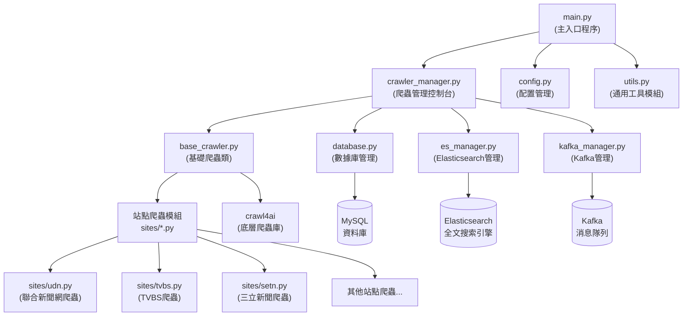
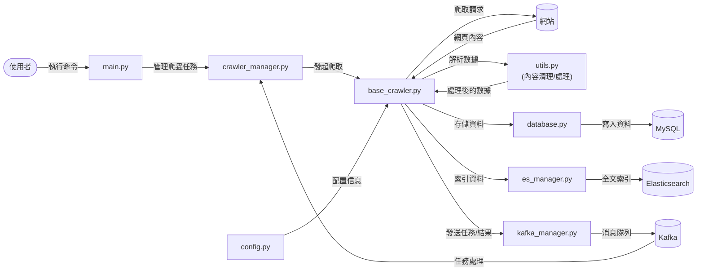

# 網頁爬蟲系統

一個多站點網頁爬蟲系統，支援多種新聞、論壇網站的內容爬取、處理和儲存。

## 系統架構

```
crawler_project/
│
├── main.py                  # 主程式入口
├── database.py              # 資料庫操作模組
├── base_crawler.py          # 基礎爬蟲類
├── config.py                # 配置管理模組
├── utils.py                 # 通用工具模組
├── crawler_manager.py       # 爬蟲管理控制台
├── es_manager.py            # Elasticsearch管理
├── kafka_manager.py         # Kafka管理
├── rate_limiter.py          # 流量控制模組
│
├── sites/                   # 站點爬蟲目錄
│   ├── __init__.py
│   ├── udn.py               # 聯合新聞網爬蟲
│   ├── tvbs.py              # TVBS爬蟲
│   ├── setn.py              # 三立新聞爬蟲
│   └── ...                  # 其他站點爬蟲
│
└── output/                  # 輸出目錄
    ├── crawler.log          # 爬蟲日誌
    ├── *_report.json        # 爬蟲報告
    └── *.csv                # 爬蟲數據CSV檔案
```

## 主要功能

- **多站點支援**：支援多種新聞、論壇等網站的內容爬取
- **自動內容處理**：自動清理和提取文章內容、發布時間等
- **多種存儲選項**：支援 MySQL、Elasticsearch 和本地 CSV 儲存
- **智能流量控制**：避免被目標網站阻擋
- **錯誤處理和重試**：自動處理各種錯誤情況並支援重試機制
- **爬蟲統計和報告**：記錄爬蟲執行情況，提供統計報告

## 依賴項目

- Python 3.8+
- Crawl4AI==0.4.248
- elasticsearch==8.17.1
- kafka_python==2.0.2
- pandas==2.2.3
- PyMySQL==1.1.1

## 安裝說明

1. 複製專案代碼：

```bash
git clone https://github.com/yourusername/crawler_project.git
cd crawler_project
```

2. 安裝依賴包：

```bash
pip install -r requirements.txt
```

3. 配置資料庫和其他服務：

編輯 `config.py` 檔案，設定 MySQL、Elasticsearch 和 Kafka 連接等參數。

## 使用方法

### 初始化系統

首次使用前，需要初始化系統，創建必要的資料庫表和索引：

```bash
python main.py --init
```

### 爬取特定站點

```bash
python main.py --site udn
```

### 爬取所有站點

```bash
python main.py --all
```

### 爬取特定類別的站點

```bash
python main.py --category news
```

### 列出所有支援的站點

```bash
python main.py --list
```

### 顯示爬蟲統計資訊

```bash
python main.py --stats
```

### 清除 URL 快取

```bash
python main.py --clear-cache
```

## 新增爬蟲站點

要新增爬蟲站點，請按照以下步驟操作：

1. 在 `sites/` 目錄下創建新的 Python 模組，例如 `sites/new_site.py`
2. 使用標準爬蟲模板實現特定站點的爬蟲邏輯
3. 在 `config.py` 中新增站點配置信息

範例代碼：

```python
"""
新站點爬蟲模組
"""

import re
import logging
from typing import List, Dict, Any, Optional

from base_crawler import BaseCrawler, register_crawler
from utils import extract_publish_time

# 設定站點名稱
SITE_NAME = "new_site"

# 設定日誌
logger = logging.getLogger(f"{SITE_NAME}_crawler")

class NewSiteCrawler(BaseCrawler):
    """新站點爬蟲，繼承並擴展 BaseCrawler"""
    
    def __init__(self):
        """初始化爬蟲"""
        super().__init__(SITE_NAME)
        logger.info(f"{SITE_NAME} 爬蟲初始化完成")
    
    async def extract_article(self, url: str) -> Optional[Dict[str, Any]]:
        """對網頁內容進行特殊處理"""
        # 調用基礎類方法獲取內容
        article = await super().extract_article(url)
        
        # 站點特定處理邏輯
        if article and "content" in article:
            # 處理文章內容
            article["content"] = self._process_content(article["content"])
            
            # 提取額外元數據
            self._extract_metadata(article, url)
            
        return article
    
    def _process_content(self, content: str) -> str:
        """處理文章內容的特定邏輯"""
        # 實現特定的內容處理邏輯
        return content
    
    def _extract_metadata(self, article: Dict[str, Any], url: str) -> None:
        """提取特定元數據"""
        # 實現特定的元數據提取邏輯
        pass

# 註冊爬蟲類
register_crawler(SITE_NAME, NewSiteCrawler)

# 為保持與舊版代碼兼容的接口函數
async def get_new_links() -> List[str]:
    """獲取新連結 (兼容舊版接口)"""
    crawler = NewSiteCrawler()
    return await crawler.get_new_links()

async def run_full_scraper() -> bool:
    """執行完整爬蟲 (兼容舊版接口)"""
    crawler = NewSiteCrawler()
    return await crawler.run_full_scraper()
```

## 錯誤處理

系統會自動處理各種錯誤情況，包括連接問題、解析錯誤等，錯誤記錄會被保存在：

- `output/crawler.log` - 詳細的爬蟲日誌
- 資料庫中的 `failed_crawls` 表 - 記錄失敗的 URL

## 系統架構圖

### 組件流程圖



### 數據流圖



## 效能考量

- **延遲控制**：每個站點可以在 `config.py` 中配置不同的請求延遲
- **並發限制**：系統會自動控制爬蟲並發數，避免過度請求
- **資源使用**：針對大型站點可以調整 `CRAWLER_LIMITS` 參數

## 貢獻指南

1. Fork 此專案
2. 創建您的功能分支 (`git checkout -b feature/amazing-feature`)
3. 提交您的更改 (`git commit -m 'Add some amazing feature'`)
4. 推送到分支 (`git push origin feature/amazing-feature`)
5. 開啟一個 Pull Request

## 許可證

[MIT](LICENSE)
