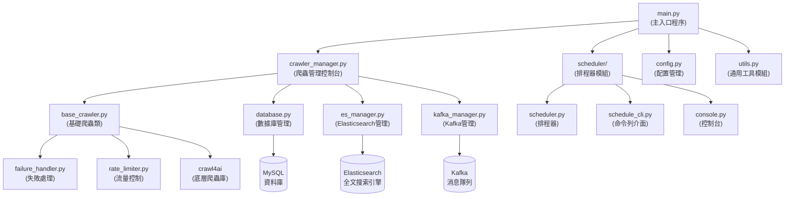
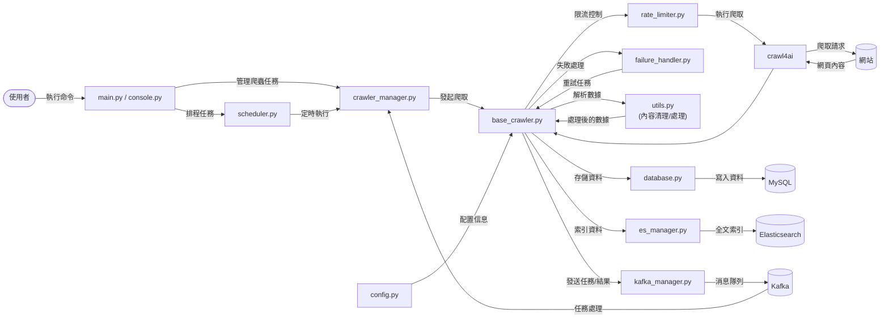

# 網頁爬蟲系統

一個多站點網頁爬蟲系統，支援多種新聞、論壇網站的內容爬取、處理和儲存。以 `crawl4ai` 為基礎，提供全面的網頁爬取、數據處理和資料儲存功能。

## 系統特色

- **高效並行處理**：使用非同步處理 (asyncio) 和並行爬取實現高效率爬蟲
- **智慧流量控制**：內建域名級別和全局級別的流量控制機制
- **差異化重試策略**：針對不同錯誤類型使用不同的重試策略
- **多種儲存選項**：支援 MySQL、Elasticsearch 和本地檔案系統儲存
- **排程系統**：內建排程器自動安排爬取任務
- **容器化支援**：完整的 Docker 容器化支援，方便部署
- **監控與統計**：健康檢查、備份和統計報表
- **擴展性良好**：易於添加新站點，每個站點獨立設定

## 系統架構

```
crawler_project/
│
├── main.py                  # 主程式入口
├── crawler_manager.py       # 爬蟲管理控制台
├── base_crawler.py          # 基礎爬蟲類
├── database.py              # 資料庫操作模組
├── config.py                # 配置管理模組
├── es_manager.py            # Elasticsearch 管理
├── kafka_manager.py         # Kafka 管理
├── failure_handler.py       # 失敗處理模組
├── rate_limiter.py          # 流量控制模組
├── utils.py                 # 通用工具模組
│
├── scheduler/               # 排程器目錄
│   ├── __init__.py          # 排程器初始化
│   ├── scheduler.py         # 主排程器邏輯
│   ├── schedule_cli.py      # 排程器命令列介面
│   └── console.py           # 排程器控制台
│
├── scripts/                 # 輔助腳本目錄
│   ├── deploy-to-aws.sh     # AWS 部署腳本
│   ├── backup-data.sh       # 資料備份腳本
│   └── healthcheck.sh       # 系統健康檢查腳本
│
├── elasticsearch-docker/    # Elasticsearch Docker 配置
│   ├── Dockerfile           # Elasticsearch 容器定義
│   └── docker-compose.yml   # Elasticsearch 服務配置
│
├── kafka-docker/            # Kafka Docker 配置
│   └── docker-compose.yml   # Kafka 服務配置
│
├── Dockerfile               # 主爬蟲系統容器定義
├── docker-compose.yml       # 完整系統服務配置
│
└── output/                  # 輸出目錄
    ├── crawler.log          # 爬蟲日誌
    ├── *_report.json        # 爬蟲報告
    └── failed_urls.csv      # 失敗 URL 記錄檔
```

## 主要功能

### 1. 多站點支援

系統支援多種類型網站的爬取，包括：

- 新聞網站：TVBS、聯合新聞網、ETtoday、三立新聞等
- 財經網站：中時財經、工商時報等
- 論壇網站：Mobile01 等
- 部落格：Pixnet 等

每個站點都可以有獨立的爬取設定，包括起始 URL、內容選擇器、域名延遲等。

### 2. 智慧流量控制

- **域名級別限流**：針對不同網站自動調整爬取頻率
- **全局流量限制**：控制整體爬取速率
- **動態調整**：根據爬取成功/失敗情況動態調整延遲
- **限流保護**：當特定網站達到限流閾值時，自動進入冷卻期

### 3. 錯誤處理與重試

- **錯誤分類**：將錯誤分為網絡錯誤、服務器錯誤、客戶端錯誤等
- **差異化重試**：根據錯誤類型使用不同的重試策略
- **指數退避**：重試間隔隨著失敗次數增加而指數增長
- **持久化記錄**：失敗 URL 會被記錄並在合適時機重試

### 4. 內容處理

- **自動清理**：移除廣告、贊助連結等無關內容
- **發布時間提取**：自動從文章中提取發布時間
- **內容歸一化**：將不同站點的內容格式統一
- **特定站點優化**：針對特定站點的內容進行特殊處理

### 5. 資料儲存

- **MySQL**：結構化存儲文章內容和元數據
- **Elasticsearch**：提供全文搜索功能
- **Kafka**：用於任務和結果的消息傳遞
- **CSV 匯出**：將爬取結果匯出為 CSV 檔案

### 6. 排程系統

- **定時爬取**：可設定不同站點的爬取頻率
- **分類排程**：新聞類站點更頻繁爬取，其他類別較低頻率
- **命令列管理**：提供命令列工具管理排程任務

## 依賴項目

- Python 3.8+
- Crawl4AI==0.4.248
- elasticsearch==8.17.1
- kafka_python==2.0.2
- pandas==2.2.3
- PyMySQL==1.1.1
- APScheduler==3.10.1
- tabulate==0.9.0

## 安裝說明

### 方法 1: 使用 Docker（推薦）

1. 確保已安裝 Docker 和 Docker Compose

2. 複製專案程式碼：

```bash
git clone https://github.com/yourusername/crawler_project.git
cd crawler_project
```

3. 建立 `.env` 檔案配置資料庫等連線資訊：

```bash
DB_HOST=localhost
DB_USER=your_db_user
DB_PASSWORD=your_db_password
DB_DATABASE=crawl
```

4. 啟動系統：

```bash
docker-compose up -d
```

### 方法 2: 直接安裝

1. 複製專案程式碼：

```bash
git clone https://github.com/yourusername/crawler_project.git
cd crawler_project
```

2. 安裝依賴套件：

```bash
pip install -r requirements.txt
```

3. 設定 Elasticsearch 和 Kafka：
   - 使用 `elasticsearch-docker/` 和 `kafka-docker/` 目錄下的 Docker 配置或自行設定

4. 初始化系統：

```bash
python main.py --init
```

## 使用方法

### 基本爬蟲操作

```bash
# 初始化系統
python main.py --init

# 爬取特定站點
python main.py --site udn

# 爬取所有站點
python main.py --all

# 爬取特定類別的站點
python main.py --category news

# 列出所有支援的站點
python main.py --list

# 顯示爬蟲統計資訊
python main.py --stats

# 清除 URL 快取
python main.py --clear-cache
```

### 排程器操作

可以使用專門的排程器命令列工具：

```bash
# 啟動排程器
python scheduler/schedule_cli.py start

# 停止排程器
python scheduler/schedule_cli.py stop

# 查看排程狀態
python scheduler/schedule_cli.py status

# 列出所有可用站點
python scheduler/schedule_cli.py list-sites

# 排程特定站點
python scheduler/schedule_cli.py schedule-site udn "*/10 * * * *"

# 排程特定類別站點
python scheduler/schedule_cli.py schedule-category news "*/10 * * * *"

# 排程所有站點
python scheduler/schedule_cli.py schedule-all

# 立即執行特定站點爬取
python scheduler/schedule_cli.py run-now udn

# 移除特定站點排程
python scheduler/schedule_cli.py remove-site udn
```

### 整合控制台

也可以使用整合控制台進行操作：

```bash
# 初始化系統
python scheduler/console.py init

# 爬取特定站點
python scheduler/console.py crawl --site udn

# 爬取特定類別站點
python scheduler/console.py crawl --category news

# 爬取所有站點
python scheduler/console.py crawl --all

# 啟動排程器
python scheduler/console.py scheduler start

# 停止排程器
python scheduler/console.py scheduler stop

# 顯示排程器狀態
python scheduler/console.py scheduler status

# 列出所有站點
python scheduler/console.py list

# 顯示爬蟲統計
python scheduler/console.py stats
```

## 新增爬蟲站點

要新增爬蟲站點，只需在 `config.py` 的 `SITE_CONFIG` 字典中添加新的站點配置：

```python
SITE_CONFIG = {
    # 原有站點...
    
    "new_site": {
        "site_id": 20,  # 為新站點分配一個唯一 ID
        "website_category": "news",  # 站點類別
        "start_urls": [
            "https://www.example.com/",
            "https://www.example.com/news",
        ],
        "url_pattern": "article/",  # URL 匹配模式（字串或正則表達式）
        "is_regex": False,  # 是否使用正則表達式
        "domain_delay": 3.0,  # 域名延遲（秒）
        "content_selector": {  # 內容選擇器
            "name": "Article",
            "baseSelector": "article",
            "fields": [
                {"name": "content", "selector": "div.article-content", "type": "text", "multiple": True}
            ]
        }
    },
}
```

系統會自動使用基礎爬蟲類處理新站點。如果需要特殊處理，可以在 `sites/` 目錄下創建特定的爬蟲類。

## 部署到 AWS

系統提供 AWS 部署腳本，可以輕鬆部署到 EC2 實例：

```bash
# 部署到 AWS
./scripts/deploy-to-aws.sh production ap-northeast-1
```

## 資料備份

使用備份腳本進行資料備份：

```bash
# 備份資料到 S3
./scripts/backup-data.sh ec2-xx-xx-xx-xx.compute-1.amazonaws.com ~/.ssh/aws-crawler-key.pem crawler-backups 30
```

## 系統監控

使用健康檢查腳本監控系統：

```bash
# 健康檢查
./scripts/healthcheck.sh ec2-xx-xx-xx-xx.compute-1.amazonaws.com ~/.ssh/aws-crawler-key.pem admin@example.com 3
```

## 系統架構圖

### 組件流程圖



### 數據流圖



## 效能考量

- **併發控制**：使用 `MemoryAdaptiveDispatcher` 自動調整併發數量
- **記憶體管理**：爬蟲過程中監控記憶體使用率，避免 OOM
- **延遲控制**：每個站點可以在 `config.py` 中配置不同的請求延遲
- **資源使用**：針對大型站點可以調整 `CRAWLER_LIMITS` 參數
- **數據庫優化**：使用批量插入減少數據庫操作次數


## 授權條款

[MIT](LICENSE)
